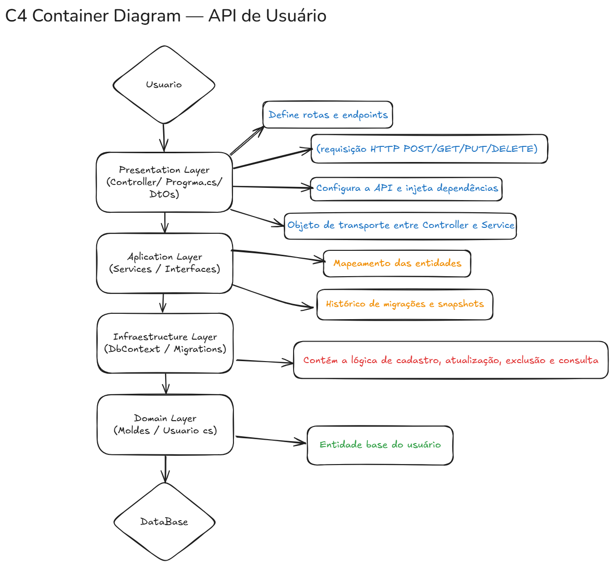
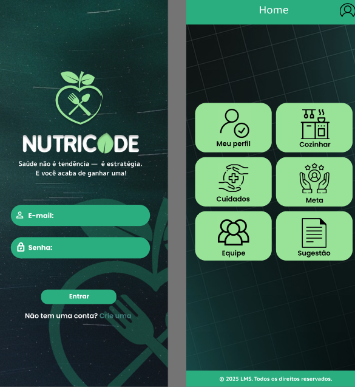

**Saúde não é tendência — é estratégia. E você acaba de ganhar uma!**


## 📘 Definição do Projeto

### 🎯 Objetivo
Esta API é responsável por **gerenciar o cadastro e manutenção de usuários** do sistema principal de **alimentação saudável personalizada**.  
Ela permite que os usuários sejam criados, consultados, atualizados e removidos — servindo como **base de autenticação e controle de perfis** da aplicação.

### 🧱 Problema Resolvido
O projeto centraliza o **gerenciamento de perfis de usuário** em um único módulo desacoplado, facilitando:
- a integração com outras aplicações (como o módulo de nutrição em Java);
- a manutenção e escalabilidade do sistema;
- e a aplicação de boas práticas de arquitetura limpa.

---

## ⚙️ Escopo e Funcionalidades

### Funcionalidades Implementadas
- 🧾 CRUD de Usuário (`GET`, `POST`, `PUT`, `DELETE`);
- 🔗 API REST com endpoints documentados via Swagger;
- 🧠 Lógica de negócio isolada em **Services**;
- 🧩 DTOs para transporte de dados entre camadas;
- 💾 Persistência de dados com **Entity Framework Core**;
- ⚙️ Injeção de dependências configurada via `Program.cs`.

### Futuras Extensões
- Autenticação com **JWT**;
- Integração com módulo Java (nutrição e recomendações);
- Logs e monitoramento com **Serilog**;
- Testes unitários automatizados.

---

## 🧠 Arquitetura — Clean Architecture

O projeto segue o padrão **Clean Architecture**, garantindo **baixo acoplamento**, **separação de responsabilidades** e **testabilidade**.

```
Usuario/
├── Controller/           → Define endpoints e rotas HTTP
├── Data/                 → Contexto e mapeamento do banco (EF Core)
├── Interfaces/           → Contratos e abstrações de repositórios
├── Migrations/           → Histórico de migrações do EF Core
├── Models/               → Entidades de domínio (Usuario.cs)
├── Services/             → Lógica de negócio e validações
├── UsuarioDTOs/          → DTOs usados no transporte de dados
├── Program.cs            → Configuração da API e DI
└── appsettings.json      → Configurações de ambiente
```

---

## 🧭 Diagrama Container




## 🧰 Instalação e Configuração
```
### Pré-requisitos
- [.NET SDK 8.0+](https://dotnet.microsoft.com/download)
- SQL Server (ou LocalDB)
- Editor (Visual Studio / Rider / VS Code)

### Passos para Configuração

```bash
# 1️⃣ Clonar o repositório
git clone https://github.com/seuusuario/UsuarioAPI.git
cd Usuario

# 2️⃣ Restaurar dependências
dotnet restore

# 3️⃣ Instalar pacotes principais (caso necessário)
dotnet add package Microsoft.EntityFrameworkCore
dotnet add package Microsoft.EntityFrameworkCore.Design
dotnet add package Microsoft.EntityFrameworkCore.SqlServer
dotnet add package Microsoft.EntityFrameworkCore.Tools
dotnet add package Swashbuckle.AspNetCore
dotnet add package Microsoft.AspNetCore.Mvc
dotnet add package Microsoft.AspNetCore.Mvc.NewtonsoftJson

# 4️⃣ Criar e atualizar o banco
dotnet ef migrations add InitialCreate
dotnet ef database update

# 5️⃣ Executar o projeto
dotnet run
```
---

## 🗄️ Configuração do Banco de Dados

O projeto utiliza **SQL Server** (ou outro banco configurado no `appsettings.json`).

Crie um arquivo `.env` na raiz do projeto com as credenciais de acesso:

```bash
DB_NAME=Fiap
DB_USER=RM560914
DB_PASSWORD=fiap25
```
Após iniciar, acesse:  
👉 **https://localhost:5001/swagger**

---

## 📡 Endpoints Principais

| Método | Rota | Descrição |
|--------|------|------------|
| `GET` | `/Usuario` | Lista todos os usuários |
| `POST` | `/Usuario` | Cadastra um novo usuário |
| `PUT` | `/Usuario/{id}` | Atualiza um usuário existente |
| `DELETE` | `/Usuario/{id}` | Remove um usuário |

### Exemplo de Requisição JSON (POST)

```json
{
  "id": 1,
  "nome": "Lucas Siqueira",
  "email": "lucas@email.com",
  "senha": "123456"
}
```

---

---

## 🌐 Acesso à Aplicação

Após iniciar o servidor com o comando:

```bash
dotnet run
```
a API estará disponível por padrão no seguinte endereço:

```
http://localhost:5250/
```
Caso o endpoint principal não carregue automaticamente, acesse a documentação interativa (Swagger UI) pelo link:
```
http://localhost:5250/swagger/index.html

```


### 🔹 Tela de Login


### 🔹 Ícone de Cuidados

---

## 🧩 Tecnologias Utilizadas
- **.NET 8 / C#**
- **Entity Framework Core**
- **Swagger (Swashbuckle)**
- **Dependency Injection**
- **RESTful API**

---

## 👨‍💻 Autor
**Lucas Siqueira**  
Desenvolvedor Back-End .NET  
Projeto acadêmico — Arquitetura Limpa e Boas Práticas de API

---

## ⚖️ Licença
Este projeto é licenciado sob a licença **MIT**.  
Você pode usar, modificar e distribuir livremente com atribuição ao autor.


## 📎 Link do Projeto

🔗 **Repositório GitHub:** [https://github.com/seuusuario/nutricode](https://github.com/seuusuario/nutricode)


